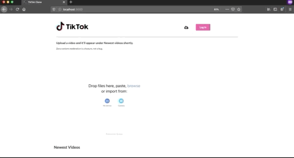

# TikTok Clone

Welcome! In this workshop, we're going to be building a simple [TikTok](https://tiktok.com) clone using [React](https://reactjs.org/) (a front-end javascript framework), [Uppy](https://uppy.io) (an open source file uploader) and [Transloadit](https://transloadit.com) (a file processing service).



The goal of this webinar is to give you a basic understand of how apps like TikTok and Instagram might handle things on the other side of the screen — apply filters, watermarks, audio tracks etc — step by step. We'll also be looking into basic concepts of React, as well as how to style your application.

## What you'll need

1. A text editor — check out [Sublime](https://www.sublimetext.com/) or [VSCode](https://code.visualstudio.com/).
2. A browser with developer tools (that would allow you to _Inspect Element_), such as Firefox or Chrome.
3. [Node and npm](https://docs.npmjs.com/downloading-and-installing-node-js-and-npm) installed (recommended, but most definitely not required: [yarn](https://classic.yarnpkg.com/en/docs/install/#mac-stable)).
4. [React and React-DOM](https://www.codecademy.com/articles/react-setup-i) libraries installed.
5. A [Transloadit](https://transloadit.com) account with a verified email address — you will be able to create an application and get your API key from there.
6. This link for styles: https://cdnjs.cloudflare.com/ajax/libs/semantic-ui/2.4.1/semantic.min.css

To check that you've installed everything correctly, run ```npx create-react-app my-app``` in the terminal, where `my-app` is a name you can specify. This will create a template React application.

If you have done all of the above, you should also be able to download this repository, open the command line/command prompt, navigate to the project directory, then

```console
foo@bar:~$ npm install
foo@bar:~$ npm start
```

or, with yarn

```console
foo@bar:~$ yarn install
foo@bar:~$ yarn start
```

will run the app in the development mode.

Open [http://localhost:3000](http://localhost:3000) to view it in the browser. The page will reload if you make edits.

---

Note: if you have downlaoded this repository and want to run it on your own machine, navigate to `src/UppyComponent.js` and replace `REACT_APP_TRANSLOADIT_API` in

```
this.uppy.use(Transloadit, {
			params: {
				auth: {
					key: process.env.REACT_APP_TRANSLOADIT_API,
				},
			}
		}
		)
```

with your API key as a string that you generated from Transloadit, like so

```
key: "12345678956776658798",
```

## What is [React](https://reactjs.org/)?

From Wikipedia,

> React is an open-source JavaScript library for building user interfaces. It is maintained by Facebook and a community of individual developers and companies. React can be used as a base in the development of single-page or mobile applications.

Basically, it's the magic that ensures that when you scroll through Facebook, the page doesn't reload.

## What is [Uppy](https://uppy.io)?

An open-source file uploader that we'll use as a means of transport to send the videos you take with your webcam directly to Transloadit.

## What is [Transloadit](https://transloadit.com)?

A file processing services. It takes your images, documents, or, in our case — videos — and applies all sorts of good things to them. Watermarks, filters, music tracks.

---

If you have any questions, please feel free to create an Issue in this repository, or get in touch directly!
